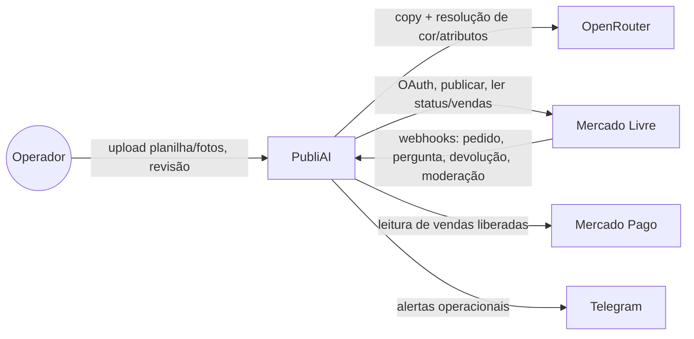
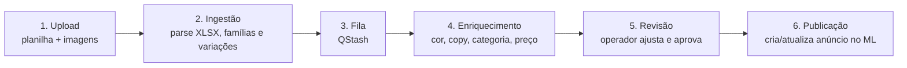

# Visão Geral

## O que é

PubliAI é um sistema interno que transforma planilhas de produtos (linha/botão/fita, categoria
de aviamentos) em anúncios publicados em marketplaces, usando IA como copywriter e para resolução
de cor/atributos. Primeiro marketplace em produção: **Mercado Livre**. Usuário-operador principal:
Diego.

## Contexto do sistema

## Estado atual

- Épicos validados em produção: `E1`, `E1b`, `E2`, `E3`, `E4`
- Próximo épico de produto: `E5` — conector Shopee (**ainda não implementado**; ver [[Publicação Shopee]])
- Split de produto em N anúncios (produtos com >100 cores) em produção
- Multiusuário com permissão de menu em produção (operação compartilhada, sem `org_id` ainda)
- Módulo Financeiro (caixa, margem, evolução temporal) em produção
- Fonte sempre atualizada: `docs/project-status.md`

## Pipeline principal

Ver detalhe em [[Fluxo Completo]].

## Stack

- **Frontend:** React 18 + TypeScript + Vite + shadcn/ui + Tailwind + TanStack Query + Zustand — ver [[Frontend]]
- **Backend:** Supabase (Postgres + Edge Functions/Deno + Storage + Auth) — ver [[Backend]], [[Supabase]]
- **Fila/cache:** Upstash QStash + Redis
- **IA:** OpenRouter (SDK compatível com OpenAI) — copy + Vision
- **Hospedagem do frontend:** Render Static Site

## Módulos principais (rotas do app)

Roteamento real em `src/App.tsx` (`HashRouter`): Dashboard, Lotes, Progresso, Revisão, Relatório,
Configurações, Publicados, Faturamento, Financeiro, Viabilidade, Usuários. Ver [[Dashboard]],
[[Produtos]], [[Marketplace]], [[IA]].

## Onde cavar mais fundo

- Arquitetura detalhada (comunidades do grafo, god nodes): [[Arquitetura Geral]]
- Termos do domínio: [[Glossário]]
- Decisões arquiteturais: `docs/decisions/` (espelhado em `04-Decisões/`)
