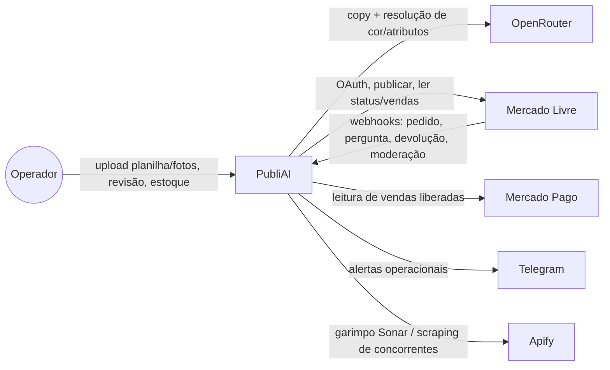

# Visão Geral

## O que é

PubliAI é um sistema interno que transforma planilhas de produtos (linha/botão/fita, categoria
de aviamentos) em anúncios publicados em marketplaces, usando IA como copywriter e para resolução
de cor/atributos. Primeiro marketplace em produção: **Mercado Livre**. Usuário-operador principal:
Diego.

## Contexto do sistema

```mermaid
flowchart LR
    Operador((Operador))
    PubliAI[PubliAI]
    ML[Mercado Livre]
    MP[Mercado Pago]
    OR[OpenRouter]
    TG[Telegram]
    AP[Apify]

    Operador -->|upload planilha/fotos, revisão, estoque| PubliAI
    PubliAI -->|copy + resolução de cor/atributos| OR
    PubliAI -->|OAuth, publicar, ler status/vendas| ML
    ML -->|webhooks: pedido, pergunta, devolução, moderação| PubliAI
    PubliAI -->|leitura de vendas liberadas| MP
    PubliAI -->|alertas operacionais| TG
    PubliAI -->|garimpo Sonar / scraping de concorrentes| AP
```

## Estado atual

- Épicos validados em produção: `E1`, `E1b`, `E2`, `E3`, `E4`, `E7`, `E6`, `E6b` (Blocos A e B)
- Próximo épico de produto: `E5` — conector Shopee (**ainda não implementado**; ver [[Publicação Shopee]])
- Split de produto em N anúncios (produtos com >100 cores) em produção
- Multi-tenancy por `org_id` em produção desde o E7 (2026-07-05, [ADR-0027](../04-Decisões/) · [docs/architecture/06-multi-tenant](../../docs/architecture/diagrams/06-multi-tenant/)) — cada organização isola os próprios dados; operação compartilhada (ADR-0047) continua valendo *dentro* de cada organização
- Módulo Estoque (`/estoque`): ledger imutável `estoque_movimentos`, push cross-canal, cadastro manual, kit vinculado (ADR-0151) e reposição rápida
- Módulo Pulse (`/pulse`): inteligência de mercado, radar de concorrência qualificada (ADR-0130) e garimpo Sonar (ADR-0140) com Apify fallback
- Módulo Financeiro (caixa, margem, evolução temporal) e Faturamento em produção
- Fonte sempre atualizada: `docs/project-status.md`

## Pipeline principal

```mermaid
flowchart LR
    U[1. Upload / Cadastro<br/>planilha + imagens ou manual] --> I[2. Ingestão<br/>parse XLSX / cadastro, famílias e variações]
    I --> F[3. Fila<br/>QStash]
    F --> E[4. Enriquecimento<br/>cor, copy, categoria, preço]
    E --> R[5. Revisão<br/>operador ajusta e aprova]
    R --> P[6. Publicação<br/>cria/atualiza anúncio no ML]
```

Ver detalhe em [[Fluxo Completo]].

## Stack

- **Frontend:** React 18 + TypeScript + Vite + shadcn/ui + Tailwind + TanStack Query + Zustand — ver [[Frontend]]
- **Backend:** Supabase (Postgres + Edge Functions/Deno + Storage + Auth) — ver [[Backend]], [[Supabase]]
- **Fila/cache:** Upstash QStash + Redis
- **IA:** OpenRouter (SDK compatível com OpenAI) — copy + Vision
- **Scraping / Intel:** Apify (ator Mercado Livre para dados do nicho Sonar)
- **Hospedagem do frontend:** Render Static Site

## Módulos principais (rotas do app)

Roteamento real em `src/App.tsx` (`HashRouter`): Dashboard, Lotes, Progresso, Revisão, Relatório,
Configurações, Publicados, Faturamento, Financeiro, Viabilidade, Estoque, Pulse, Canais, Usuários. Ver [[Dashboard]],
[[Produtos]], [[Estoque]], [[Pulse]], [[Marketplace]], [[IA]].

## Onde cavar mais fundo

- Arquitetura detalhada (comunidades do grafo, god nodes): [[Arquitetura Geral]]
- Termos do domínio: [[Glossário]]
- Decisões arquiteturais: `docs/decisions/` (espelhado em `04-Decisões/`)
