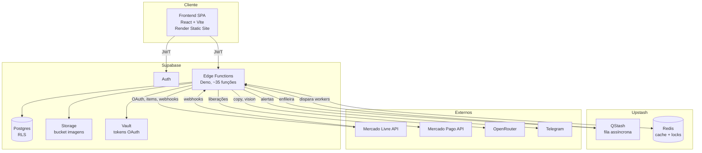
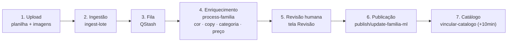

# Arquitetura Geral

Fonte primária: **[[Graphify]]** (grafo `src/`+`supabase/`, 1747 nós, 4650 arestas, 82
comunidades) + `docs/explanation/arquitetura.md`. Ver também [[Frontend]], [[Backend]],
[[Supabase]], [[Banco de Dados]].

> Diagramas visuais atualizados (pós-E6/E7, Archify): `docs/architecture/` — ver especialmente
> [02-general-architecture](../../docs/architecture/diagrams/02-general-architecture/) e
> [06-multi-tenant](../../docs/architecture/diagrams/06-multi-tenant/). Os diagramas mermaid
> abaixo são anteriores ao E6/E7 e não mostram `org_id`/multicanal.

## Em uma frase

PubliAI transforma planilhas de produtos em anúncios publicados em marketplaces (hoje Mercado
Livre), usando IA como copywriter e um pipeline assíncrono com revisão humana obrigatória antes
de cada publicação.

## Princípios que moldam o sistema

1. **Revisão humana antes de publicar** — o pipeline para na etapa de revisão; nada vai ao ar
   sem aprovação do operador.
2. **Workers idempotentes** — toda Edge Function disparada por fila pode ser reexecutada sem
   efeito colateral duplicado (claims atômicos, upserts). Ver [[Edge Functions]].
3. **Assíncrono por fila** — trabalho pesado (IA, publicação no ML) sai do request HTTP e vai
   para o QStash.
4. **Multi-tenant por `org_id` + RLS** (E7, 2026-07-05) — cada organização só enxerga os próprios dados; `current_org_id()` é o pivô da RLS. Ver [[Segurança]] e `docs/architecture/diagrams/06-multi-tenant/`.
5. **Segredos fora do código** — tokens OAuth no Vault; chaves de API em Supabase Secrets.
6. **Multicanal por abstração** — a lógica de publicação fala com um *conector* de canal, não
   com o ML diretamente. Ver [[Integrações]].

## Contêineres (C4 nível 2)



## Pipeline ponta a ponta



Referência de código: `src/lib/{ingest,publicar,publicavel,jornada,queries}.ts`;
`supabase/functions/{ingest-lote,process-familia,publish-familia-ml,update-familia-ml,vincular-catalogo}`.

## Multicanal (preparação para o 2º marketplace)

Hoje só existe o Mercado Livre, mas a arquitetura já separa **o que publicar** de **onde
publicar** via [[Integrações|conector de canal]] (`_shared/canais/`) e o espelho
`anuncios_externos`. Ver [[Publicação Shopee]] para o estado do próximo canal (não implementado).

## Módulos além da publicação

- **Faturamento** — vendas, perguntas e devoluções do ML via webhooks + backfill + reconciliação
- **Financeiro** — "a receber" e liberações via Mercado Pago
- **Monitoramento** — varredura de anúncios moderados + alertas Telegram
- **Viabilidade** — análise de concorrência e margem antes de cadastrar

## Mapa do código

```
src/            → ver [[Frontend]]
supabase/       → ver [[Backend]], [[Edge Functions]]
docs/           → documentação Diátaxis (explanation/reference/how-to/decisions)
obsidian-vault/ → este vault
```
