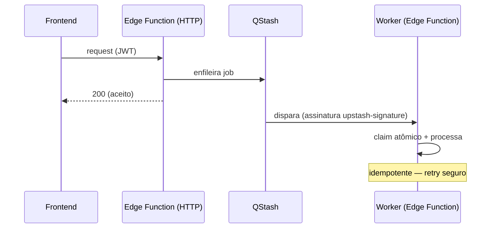

# Backend

Supabase Edge Functions (Deno). Ver detalhe completo em [[Edge Functions]], schema em
[[Banco de Dados]], plataforma em [[Supabase]].

## Padrão geral

- **~35 Edge Functions** em `supabase/functions/`, cada uma um `index.ts` + módulos
  compartilhados em `_shared/`.
- **Dois modos de acionamento:** HTTP direto do frontend (`verify_jwt=true`, JWT do usuário) ou
  worker disparado pelo QStash/webhook (`verify_jwt=false`, autentica por conta própria).
- **Idempotência é regra inegociável** — claims atômicos, upserts, reuso de IDs já gravados.
  Todo worker pode ser reexecutado pelo retry do QStash sem duplicar efeito.
- **Dois clientes Supabase:** `adminClient()` (`service_role`, contorna RLS — usado por workers)
  e `userClient(jwt)` (respeita RLS — usado em rotas HTTP autenticadas pelo usuário).

## Módulos compartilhados (`_shared/`)

| Módulo | Provê |
|---|---|
| `auth.ts` | `requireUser(req)` — valida Bearer token |
| `cors.ts` | Headers CORS padrão (`corsHeaders`, `handleOptions()`) |
| `supabase.ts` | `adminClient()` / `userClient(jwt)` |
| `queue.ts` | QStash: enfileiramento, `garantirFilaSerial`, `verificarAssinatura` |
| `ml/*` | Integração Mercado Livre — ver [[APIs]] |
| `ai/*` | OpenRouter — copywriter, vision, categoria/atributos por LLM |
| `canais/*` | Conector multicanal — ver [[Integrações]] |
| `redis/*` | Client Redis + caches (cor, concorrência, tarifa) |
| `faturamento/*` | I/O de vendas/perguntas/devoluções |
| `mercadopago/*` | API MP + rateio financeiro |
| `categoria/*`, `cor/*`, `preco/*` | Detecção de categoria, extração de cor, lógica de preço |
| `notificacoes/*` | Telegram |
| `parser.ts` | Validação/agrupamento da planilha, matching de fotos |

## Hubs do grafo (god nodes em `supabase/`)

| Nó | Arestas | O que é |
|---|---|---|
| `corsHeaders` | 33 | CORS compartilhado por praticamente todas as funções |
| `adminClient()` | 31 | cliente privilegiado usado pelos workers |
| `handleOptions()` | 29 | preflight CORS |

## Fluxo síncrono vs assíncrono

