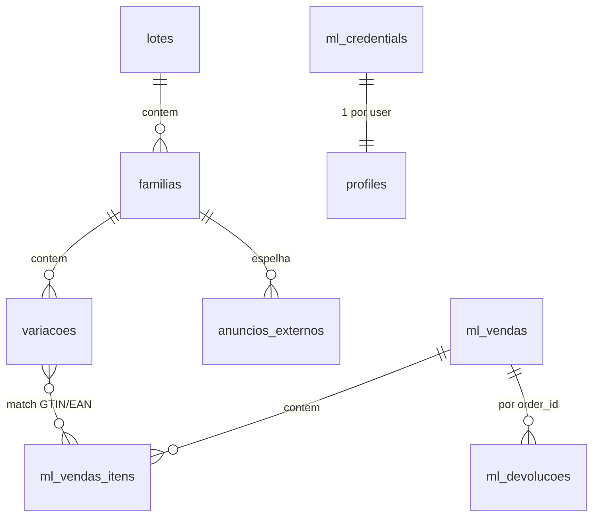

# Banco de Dados

Espelho resumido de `docs/reference/modelo-de-dados.md` (fonte de verdade). Schema Postgres via
Supabase, DDL canônico em `supabase/migrations/`. Ver [[Supabase]], [[Segurança]].

## Regras transversais

- **RLS de operação compartilhada** — tabelas de domínio liberam leitura/escrita a qualquer
  membro autenticado via `is_membro_operacao()`. `user_id` fica como `criado_por` (auditoria).
  Isolamento por `org_id` é épico futuro (`E7`).
- **Escritas sensíveis** (credenciais, faturamento) bloqueadas para `authenticated`; só via
  `service_role` (workers) ou RPC `security definer`.
- **Tokens nunca em coluna de texto** — ficam no Vault.

## Relações de domínio

## Tabelas principais

| Tabela | Papel |
|---|---|
| `lotes` | Um upload de planilha + imagens; inicia o pipeline |
| `familias` | Um PAI = um anúncio; identidade, resultado da IA, estado de publicação |
| `variacoes` | Um SKU/cor = uma variação do anúncio |
| `anuncios_externos` | Espelho multicanal, identidade `(user_id, canal, codigo_pai, particao)` |
| `ml_credentials` | Tokens OAuth do ML por usuário (no Vault) |
| `ml_vendas` / `ml_vendas_itens` | Pedidos do ML e seus itens |
| `ml_devolucoes` | Claims/devoluções |
| `ml_perguntas` | Perguntas de compradores |
| `ml_webhook_eventos` | Dedup de webhooks `(topic, resource)` |
| `ml_moderacao` | Anúncios moderados/pausados |
| `configuracoes` | Settings por usuário (desconto, Telegram) |
| `profiles` | Espelho de `auth.users` — `is_admin`, `allowed_menus` (ver [[Usuários]]) |

## Funções SQL (`security definer`)

| Função | Papel |
|---|---|
| `update_lote_counters()` | Trigger: recalcula contadores de `lotes` + transição de status |
| `upsert_ml_credentials(...)` | Grava credenciais no Vault |
| `get_ml_tokens(user_id)` | Lê tokens descriptografados do Vault (só `service_role`) |
| `is_admin()` / `is_membro_operacao()` | Helpers de RLS/RBAC — ver [[Segurança]] |
| `telegram_config_status()` | Retorna status sem expor o token |

## O que não existe (YAGNI consciente)

- Sem `catalogo_interno` — substituível por query em `familias`.
- Sem `jobs_log` — auditoria de fila vive no dashboard Upstash.
- Sem `org_id` ainda — multi-tenancy por `user_id`.
- `canal_externo` só tem `mercado_livre` até hoje.
