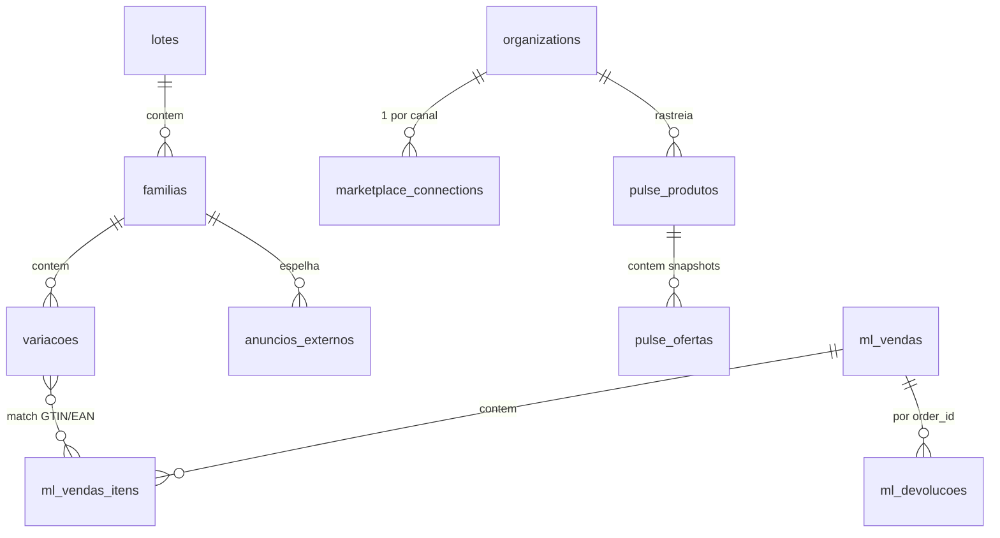

# Banco de Dados

Espelho resumido de `docs/reference/modelo-de-dados.md` (fonte de verdade). Schema Postgres via
Supabase, DDL canônico em `supabase/migrations/`. Ver [[Supabase]], [[Segurança]].

## Regras transversais

- **RLS por organização** — tabelas de domínio liberam leitura/escrita quando
  `org_id = current_org_id()`. Dentro da organização, a operação é compartilhada; `user_id`
  fica como auditoria.
- **Escritas sensíveis** (credenciais, faturamento) bloqueadas para `authenticated`; só via
  `service_role` (workers) ou RPC `security definer`.
- **Tokens nunca em coluna de texto** — ficam no Vault.

## Relações de domínio

```mermaid
erDiagram
    lotes ||--o{ familias : contem
    familias ||--o{ variacoes : contem
    familias ||--o{ anuncios_externos : espelha
    organizations ||--o{ marketplace_connections : "1 por canal"
    organizations ||--o{ pulse_produtos : "rastreia"
    pulse_produtos ||--o{ pulse_ofertas : "contem snapshots"
    ml_vendas ||--o{ ml_vendas_itens : contem
    ml_vendas ||--o{ ml_devolucoes : "por order_id"
    variacoes }o--o{ ml_vendas_itens : "match GTIN/EAN"
```

## Tabelas principais

| Tabela | Papel |
|---|---|
| `lotes` | Um upload de planilha + imagens ou lote técnico de kit/manual; inicia o pipeline |
| `familias` | Um PAI = um anúncio; identidade, resultado da IA, estado de publicação; colunas de kit (`kit_base_codigo_pai`, `kit_multiplicador` - ADR-0151) e fiscais (`ncm`, `cest`, `origem_nfe`, `csosn`, `can_invoice` - ADR-0135) |
| `variacoes` | Um SKU/cor = uma variação do anúncio |
| `anuncios_externos` | Espelho multicanal, identidade `(org_id, canal, codigo_pai, particao)` |
| `marketplace_connections` | Credenciais OAuth por organização e canal (tokens no Vault) |
| `ml_vendas` / `ml_vendas_itens` | Pedidos do ML e seus itens |
| `ml_devolucoes` | Claims/devoluções |
| `ml_perguntas` | Perguntas de compradores |
| `ml_webhook_eventos` | Dedup de webhooks `(topic, resource)` |
| `ml_moderacao` | Anúncios moderados/pausados |
| `ml_mensagens` | Mensagens pós-venda |
| `estoque_movimentos` | Ledger imutável de estoque (venda, entrada, estorno, ajuste) — ver [[Estoque]] |
| `venda_item_custo` | Custo congelado por item vendido, insert-once (ADR-0109) |
| `notificacoes` | Espelho in-app dos alertas do Telegram (ADR-0085) |
| `pulse_produtos` / `pulse_ofertas` | Radar de concorrência: produtos monitorados e snapshots de ofertas |
| `pulse_vendedores` / `pulse_alertas` | Sellers qualificados e histórico de alertas de Buy-Box / concorrência |
| `sonar_snapshots` | Histórico global de buscas no Sonar para comparação temporal de vendas |
| `empresa_fiscal` | Dados fiscais da organização (CNPJ, IE, regime, endereço) para faturamento ML |
| `configuracoes` | Settings por organização (desconto, Telegram, alíquotas — ver [[Configurações]]) |
| `organizations` | Tenant; `canais_habilitados` e `modulos_habilitados` |
| `profiles` | Espelho de `auth.users` — `is_admin`, `allowed_menus` (ver [[Usuários]]) |

## Funções SQL (`security definer`)

| Função | Papel |
|---|---|
| `update_lote_counters()` | Trigger: recalcula contadores de `lotes` + transição de status |
| `upsert_ml_credentials(...)` | Grava credenciais no Vault |
| `get_ml_tokens(user_id)` | Lê tokens descriptografados do Vault (só `service_role`) |
| `is_admin()` / `current_org_id()` | Helpers de RLS/RBAC — ver [[Segurança]] |
| `telegram_config_status()` | Retorna status sem expor o token |
| `baixar_estoque` / `estornar_estoque` / `registrar_entrada` / `ajustar_estoque` | Únicas escritas permitidas em `variacoes.estoque` — pertencem ao role `estoque_rpc_executor` (ver [[Estoque]]) |
| `adotar_familia_migrada_up` | Adoção atômica de anúncios dissolvidos/migrados para User Products pelo ML (ADR-0104/0105) |

## O que não existe (YAGNI consciente)

- Sem `catalogo_interno` — substituível por query em `familias`.
- Sem `jobs_log` — auditoria de fila vive no dashboard Upstash.
- `canal_externo` só tem `mercado_livre` até hoje.
