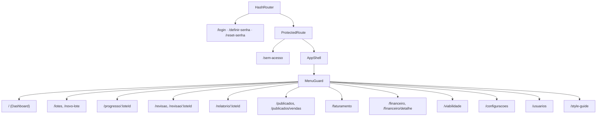

# Frontend

## Stack

React 18 + TypeScript + Vite + shadcn/ui + Tailwind + TanStack Query + Zustand + React Router
(`HashRouter`). Hospedado no Render (Static Site). Ver [[Arquitetura Geral]].

## Roteamento (`src/App.tsx`)

Todas as páginas são carregadas sob demanda (`lazy`, code-splitting) e protegidas por
`ProtectedRoute` + `MenuGuard` (permissão de menu por usuário — ver [[Segurança]]).



Ver [[Dashboard]], [[Produtos]], [[Marketplace]], [[Usuários]], [[Configurações]].

## Organização de código

```
src/
├── lib/          lógica de domínio (queries, cálculos, ingest, publicar, jornada, tipos)
├── pages/        rotas
├── components/   componentes React (dashboard/, export/, faturamento/, financeiro/, ui/)
├── hooks/        hooks de dados (TanStack Query)
├── motion/       fonte única de tokens/easings/reduced-motion (motion design system)
└── stores/       estado global (Zustand — hoje só auth-store.ts)
```

## Motion design system (`src/motion/`)

Camada de tokens/easings/reduced-motion, fonte única para toda animação do frontend
(`durationMs`, `distance`, `easing`, `useReducedMotion`) — TypeScript é a fonte primária,
`motion.css` é gerado (`scripts/gen-motion-css.ts`) e um drift test garante que os dois nunca
divergem (ADR-0079, ver [[Índice de ADRs]] em 04-Decisões). Aplicado por fases com GATE de
aprovação humana em cada uma — contrato
completo e histórico de decisões em `docs/motion/` (fora do vault). Sem biblioteca de animação
instalada (`tw-animate-css` + Radix + CSS puro cobrem as necessidades identificadas até agora).
Doc prática para consulta: `src/motion/README.md`.

- `src/hooks/` — 24 hooks de dados (ex.: `useFamilia`, `useFamiliaMutations`, `useLotes`,
  `useLoteRealtime`, `useVendas`, `useResumoVendas`, `useTarifaML`, `useConfiguracoes`).
- `src/lib/` — lógica de domínio pura (ex.: `formato.ts`, `queries.ts`, `atacado.ts`,
  `desconto.ts`, `analise-viabilidade.ts`, `faturamento.ts`, `financeiro.ts`, `database.types.ts`
  — tipos gerados do schema).
- `src/components/ui/` — primitivos shadcn/ui (button, dialog, badge, avatar, card, dropdown…).

## Hubs do grafo (god nodes em `src/`)

Segundo o [[Graphify]], os nós de maior fan-in do frontend são:

| Nó | Arestas | O que é |
|---|---|---|
| `cn()` | 163 | merge de className (shadcn), usado em quase todo componente |
| `fmtBRL()` | 40 | formatação de moeda — dashboards de Faturamento/Financeiro |
| `Button` | 39 | primitivo de UI |
| `supabase` (client) | 29 | cliente central de acesso a dados |
| `round2()` / `fmtInt()` | 20 cada | formatação numérica |
| `Periodo` | 19 | abstração de intervalo de datas, reusada em Faturamento/Financeiro/Dashboard |

Mudar a assinatura de qualquer um destes afeta dezenas de arquivos — checar o grafo antes.

## Data fetching e estado

- **TanStack Query** — cache e sincronização de dados do servidor (hooks em `src/hooks/`).
- **Zustand** — estado global de UI/sessão (`src/stores/auth-store.ts`).
- **Realtime do Supabase** — `useLoteRealtime` acompanha o progresso de um lote ao vivo.
