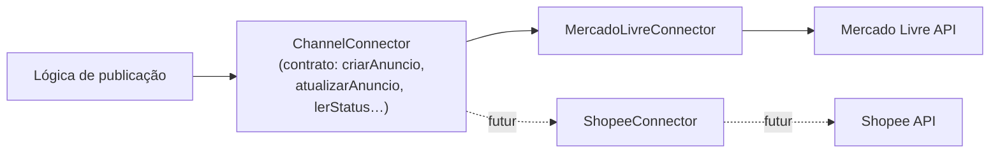

# Integrações

## Camada de abstração de canais (multicanal)

Hoje só existe o Mercado Livre, mas a lógica de publicação já fala com um **conector de canal**,
não diretamente com o ML — preparação para o épico `E5` (Shopee, ver [[Publicação Shopee]]).

- **`_shared/canais/contrato.ts`** — interface única (`criarAnuncio`, `atualizarAnuncio`,
  `lerStatus`, `lerMetricasVendas`, `garantirDescricao`, `aplicarAtacado`, `subirFoto`,
  `sincronizarDescricao`).
- **`_shared/canais/mercado-livre.ts`** (`MercadoLivreConnector`) — único adapter implementado
  hoje; delega às funções `_shared/ml/*`.
- **`_shared/canais/registry.ts`** — `getConnector(canal)` resolve a implementação.

## `anuncios_externos` — espelho multicanal

Identidade estável `(user_id, canal, codigo_pai, particao)`, independente de lote/família.
Workers fazem **dual-write**: gravam em `familias`/`variacoes` (fonte de verdade hoje) e em
`anuncios_externos` (espelho, pronto para o 2º canal). Ver [[Banco de Dados]].

## Integrações externas concretas

| Integração | Direção | Ver |
|---|---|---|
| Mercado Livre | bidirecional (API + webhooks) | [[APIs]] |
| Mercado Pago | leitura (liberações) | [[APIs]] |
| OpenRouter | saída (copy, vision) | [[IA]] |
| Telegram | saída (alertas) | [[APIs]] |

## Estado do épico E5 (Shopee)

Planejado, **sem implementação ainda**. Escopo previsto (fonte: `docs/project-status.md`): auth
OAuth + assinatura HMAC, mapeamento de item/variações, upload de mídia, update de estoque/preço,
leitura de status — ou seja, um novo adapter de `ChannelConnector`. Ver [[Publicação Shopee]].
