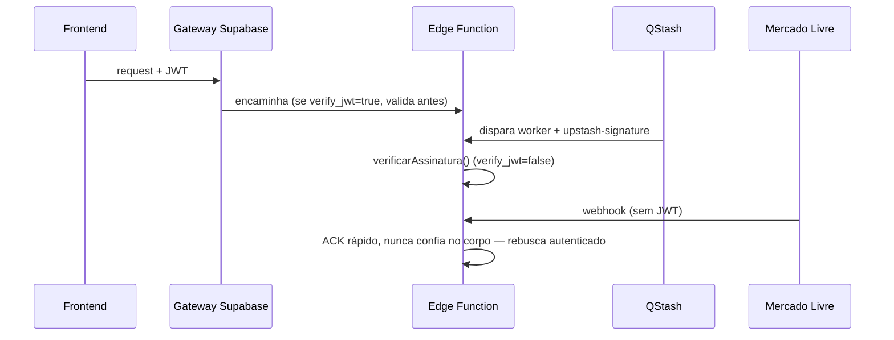

# Segurança

## Fronteiras de confiança e autenticação

- **Frontend → Edge Function:** JWT do Supabase. `verify_jwt=true` é validado pelo gateway;
  `verify_jwt=false` lê o `Authorization` na mão (`requireUser`).
- **QStash → worker:** assinatura `upstash-signature` validada por `verificarAssinatura`. Usa
  `service_role` (contorna RLS) para escrever.
- **Mercado Livre → ml-webhook:** receiver público, ACK rápido, deduplica, re-enfileira; nunca
  confia no corpo (o worker re-busca autenticado).
- **OAuth ML:** refresh de token protegido por lock Redis (evita corrida entre famílias
  paralelas); tokens no Vault.

Ver ⚠️ divergência conhecida de `verify_jwt` em [[Edge Functions]].

## RLS (Row Level Security)

- **Operação compartilhada** — tabelas de domínio liberam leitura/escrita a qualquer membro
  autenticado via `is_membro_operacao()`. `user_id` fica como `criado_por` (auditoria).
  Isolamento real por empresa (`org_id`) é o épico `E7`.
- **Escritas sensíveis** (credenciais, faturamento) bloqueadas para `authenticated`; só
  `service_role` ou RPC `security definer`.
- **Storage** — bucket `imagens` privado, RLS por prefixo de path (`auth.uid()`).

## RBAC / permissão de menu

- **`profiles`** — espelho de `auth.users`; `is_admin`, `is_active`, `allowed_menus text[]`.
- **Admin** — gerencia usuários, enxerga todos os menus.
- **Permissão de menu** — trava em dois níveis: esconde no sidebar (`MenuGuard`) e bloqueia a
  rota (`ProtectedRoute`). Não é trava de backend — a proteção real de dado é a RLS acima.
  Ver [[Usuários]], [[Frontend]].

## Segredos

- **Tokens OAuth do ML** — no Vault (`vault.secrets`), nunca em coluna de texto.
- **Chaves de API** (OpenRouter, MP, QStash, Redis) — Supabase Secrets, nunca no código/repo.
- **`telegram_bot_token`** — nunca retornado pela API; só `tem_token boolean` via RPC.

## Bloqueios externos conhecidos (não são bugs de código)

Vários endpoints do ML/MP retornam 401/403 por **permissão de app ou reputação da conta**, não
por bug — padrão documentado em `docs/reference/ml-permissao-reputacao-padrao.md` (ADR-0014,
0015, 0017, 0031, 0035, 0041). Antes de assumir bug num 401/403 do ML/MP, checar esse padrão.
