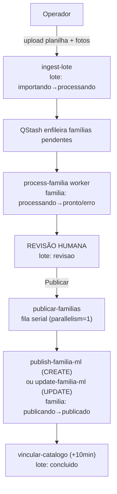

# Fluxo Completo

Jornada planilha → anúncio, espelhada nos status de `lotes` e `familias`. Ver [[Arquitetura Geral]].

## Etapas

1. **[[Upload Planilha]]** — `ingest-lote`: valida colunas, agrupa por PAI, casa fotos, detecta
   CREATE vs UPDATE, cria `familias`+`variacoes`, enfileira pendentes.
2. **[[Upload Fotos]]** — `upload-imagens-lote`: casa arquivo por nome (`00CODIGO`, `CAPA_`,
   `CAPA2_`, `CAPA3_`).
3. **[[Processamento IA]]** — `process-familia` (worker): claim atômico, resolve cor, gera copy,
   detecta categoria, monta atributos, calcula preço/concorrência.
4. **Revisão humana** — operador confere copy/preço/cor/categoria na tela Revisão, exclui
   variações, escolhe o que publicar. Etapa obrigatória — nada vai ao ar sem aprovação.
5. **[[Publicação Mercado Livre]]** — `publicar-familias` → fila serial → `publish-familia-ml`
   (CREATE) ou `update-familia-ml` (UPDATE); sobe fotos, cria/atualiza item, aplica atacado,
   espelha em `anuncios_externos`.
6. **Vínculo de catálogo** — `vincular-catalogo` (delay 10min): opt-in por GTIN; alerta Telegram
   se no-match.

## Referências de código

`src/lib/{ingest,publicar,publicavel,jornada,queries}.ts`;
`supabase/functions/{ingest-lote,process-familia,publish-familia-ml,update-familia-ml,vincular-catalogo}`.

## Módulos que acompanham o fluxo mas não fazem parte do pipeline de publicação

- **Faturamento** — vendas/perguntas/devoluções via webhook, ver [[Marketplace]]
- **Financeiro** — liberações via Mercado Pago
- **Viabilidade** — análise de concorrência/margem antes de cadastrar
