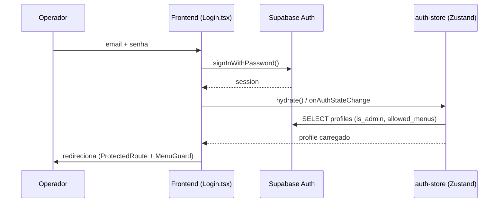

# Login

Ver [[Segurança]], [[Usuários]].

## Fluxo

## Páginas (`src/pages/`)

- **Login.tsx** — formulário e-mail/senha, chama `signIn()` (`src/lib/auth.ts`)
- **DefinirSenha.tsx** — primeira definição de senha (link do convite)
- **ResetSenha.tsx** — solicitação de reset (`sendPasswordReset()`, redireciona para
  `/#/definir-senha`)
- **SemAcesso.tsx** — exibido quando o usuário está autenticado mas sem permissão de menu

## Código

- `src/lib/auth.ts` — `signIn()`, `signOut()`, `sendPasswordReset()` (fininas sobre
  `supabase.auth.*`)
- `src/stores/auth-store.ts` (Zustand) — `hydrate()`, `setSession()`, `loadProfile()`; escuta
  `supabase.auth.onAuthStateChange`
- `src/components/protected-route.tsx` — redireciona para `/login` se não autenticado
- `src/components/menu-guard.tsx` — redireciona para `/sem-acesso` se a rota não está em
  `profile.allowed_menus` (exceto admin, que vê tudo)

## Convite de usuário

Não é auto-cadastro — usuários são convidados pelo admin (edge `usuarios`,
`auth.admin.inviteUserByEmail`). E-mail transacional via SMTP próprio (Resend), não o serviço
interno do Supabase. Ver [[Usuários]].
