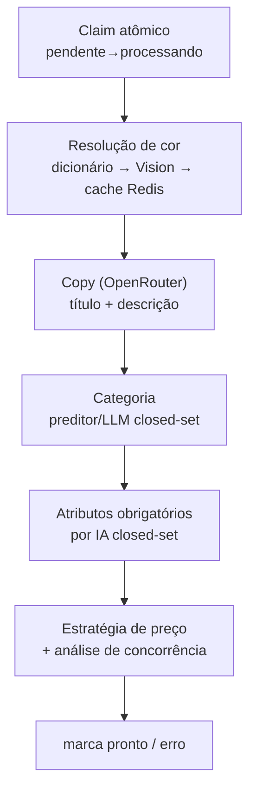

# Processamento IA

Etapa central do [[Fluxo Completo]]. Edge function `process-familia` (worker QStash,
`verify_jwt=false`, idempotente via claim atômico). Ver [[IA]], [[Integrações]].

## Pipeline dentro do worker

## Resolução de cor (camadas, ADR-0004)

1. **Dicionário** (`_shared/cor/dicionario.ts`) — termos conhecidos no texto/nome
2. **Vision** (OpenRouter, `_shared/ai/*`) — fallback quando o texto não basta
3. **Cache Redis** (`cache:cor:*`, TTL 90d) — evita rechamar IA para o mesmo código

## Copy e categoria

- **Copy** — `_shared/ai/copywriter.ts` via OpenRouter (SDK compatível OpenAI). Também extrai
  `tipo_produto_busca` (substantivo do tipo de produto, grounded em nome/descrição — ADR-0054),
  reaproveitado tanto na categoria quanto no título.
- **Categoria** — `_shared/categoria/*`: `resolverCategoria` em camadas
  (override → preditor com nome bruto + query limpa em paralelo → LLM de desempate → manual).
  Desde ADR-0054: candidatos de categoria genérica ("Outros" etc.) nunca são resposta final
  automática; a IA de desempate roda sempre que houver candidato específico (não só quando
  ambíguo) e pode abster-se deliberadamente (`category_id: null`) em vez de escolher o
  menos-pior — abstenção e falha técnica da IA são tratadas em caminhos diferentes.
- **Título** — `garantirTipoProdutoTitulo` (`_shared/ai/titulo.ts`) prefixa o tipo de produto
  quando ausente do `nome_pai` mas presente na descrição (ADR-0054); conectado em
  `process-familia`, `regenerar-copy-familia` e `titulo-particao.ts` (split ADR-0048).
- **Atributos obrigatórios** — `_shared/categoria/atributos.ts` +
  `_shared/ai/atributos-llm*.ts`, preenchimento closed-set (IA só escolhe `value_id` de lista
  permitida)

## Preço e concorrência

- **Concorrência** (`_shared/concorrencia/*`) — busca por GTIN/título no ML
- **Preço** (`_shared/preco/*`) — `PRECO` da planilha como líquido mínimo + semáforo de
  viabilidade 🟢🟡🔴; gross-up quando preço fica acima do abismo de tarifa fixa

## Resultado

Marca a família `pronto` (segue para revisão) ou `erro` (fica disponível para
`reprocessar-familia`).
