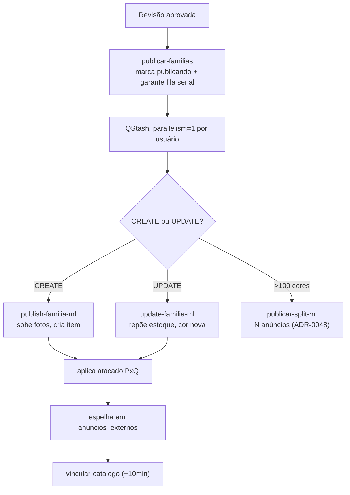

# Publicação Mercado Livre

Última etapa do [[Fluxo Completo]], após a revisão humana. Ver [[APIs]], [[Integrações]],
[[Edge Functions]].

## Fluxo

## CREATE (`publish-familia-ml`)

Sobe fotos (reusa `picture_id` em retry — idempotente), cria o item via `POST /items`, aplica
atacado (PxQ), espelha em `anuncios_externos`, enfileira vínculo de catálogo com delay de 10min.

## UPDATE (`update-familia-ml`)

Repõe estoque em cores já casadas, cria variação para cor nova (opt-out — entra marcada por
padrão), sincroniza marca/dimensões, atualiza descrição só se mudou. Preço/título/foto
preservados quando o escopo é só estoque.

## Split — produto com >100 cores (`publicar-split-ml`, ADR-0048)

O ML limita **100 variações** e **99.999 de estoque somado** por anúncio. Produtos acima disso
publicam em **N anúncios** ("partições"):

- Particionamento alfabético por cor, com **ancoragem** (cor publicada não migra de anúncio)
- Título distinto por IA por partição
- Cap de estoque aplicado no conector
- Item da partição gravado cedo (evita duplicação em retry)
- Partição 0 herda `ml_item_id` existente (compatibilidade com produto já publicado)
- Catálogo (opt-in) hoje cobre só a partição 0 — follow-up conhecido

Validado em produção: `02835002` (120 cores) em 2 anúncios (`MLB6914358210` 100 cores +
`MLB4828349403` 18 cores).

## Fila serial (ADR-0034)

Publicações concorrentes da mesma conta colidiam no ML (foto assíncrona ainda indisponível →
item travado em "publicando"). `garantirFilaSerial(userId)` força `parallelism=1` por usuário.

## Foto assíncrona — retry de propagação (ADR-0033)

`POST /pictures` (source URL) processa a foto de forma assíncrona: ela fica `status: ACTIVE` em ~2s,
mas o ML só a torna **utilizável no `POST /items` após MINUTOS** (~142s a ~5 min, varia). Antes disso
devolve `item.pictures.unavailable` ("Ocorreu um erro ao processar a foto. Por favor, envie-a
novamente."). Os três workers (CREATE/UPDATE/split) **reusam o mesmo `picture_id`** e retentam via
QStash — `retryDelay: 90s`, `retries: 5` (~7,5 min de cobertura). **Nunca re-subir a foto no retry**:
é a mesma imagem do storage e só reinicia o relógio de propagação (a mensagem "envie novamente" é
cilada). Lote #31 → `MLB4875716733`.

## Vínculo de catálogo (`vincular-catalogo`)

Opt-in por GTIN, com delay de 10min (dá tempo do item existir no ML). Alerta Telegram se
no-match ou ficha divergente (kit).
