# Upload Planilha

Primeira etapa do [[Fluxo Completo]]. Edge function `ingest-lote`
(`verify_jwt=true`, HTTP frontend, não idempotente).

## Colunas obrigatórias

`CODIGO`, `PAI`, `NOME`, `UNIDADE`, `GTIN`, `CUSTO`, `PRECO`, `ESTOQUE`,
`DESCRICAO_DETALHADO`, `PESO_GRAMAS`, `ALTURA_CM`, `LARGURA_CM`, `COMPRIMENTO_CM`, `FORNECEDOR`.

## Colunas opcionais

- **ORIGEM** — `NACIONAL`/`IMPORTADO`, lida só da linha PAI (como `FORNECEDOR`). Base do
  imposto sobre a venda (ADR-0055). Ausente/vazio/inválido → `nacional`.

## O que a função faz (`_shared/parser.ts`)

```mermaid
flowchart LR
    P[Planilha XLSX] --> V[Valida colunas]
    V --> D["Dedup por CODIGO<br/>1ª ocorrência prevalece"]
    D --> AG["Agrupa por PAI<br/>PAI=0 = agrupador, nunca vendável"]
    AG --> OR["Filho órfão?<br/>PAI referenciado não existe → descarta"]
    OR --> PS["PAI sem filho?<br/>descarta a família inteira"]
    PS --> CF["Casa fotos<br/>ver Upload Fotos"]
    CF --> CU["Detecta CREATE vs UPDATE<br/>por codigo_pai já publicado"]
    CU --> CRIA["Cria familias + variacoes"]
    CRIA --> ENF["Enfileira famílias pendentes<br/>(process-familia)"]
```

## Edge cases tratados como não-bloqueantes (ADR-0013)

- `CODIGO` duplicado — 1ª ocorrência prevalece
- Filho órfão (PAI referenciado não existe no lote) — descartado
- PAI sem nenhum filho — família inteira descartada

Nenhum desses casos derruba o lote inteiro; entram como anomalia registrada, não erro fatal.

## Detecção CREATE vs UPDATE

Reimportar uma família cujo `codigo_pai` já tem anúncio publicado vira `UPDATE` (reposição de
estoque, preço, cor nova) em vez de `CREATE`. Ver [[Publicação Mercado Livre]].

## Após o upload

O lote entra em `importando→processando`; `update_lote_counters()` recalcula contadores e faz a
transição automática para `revisao` quando todas as famílias saem de pendente/processando.
